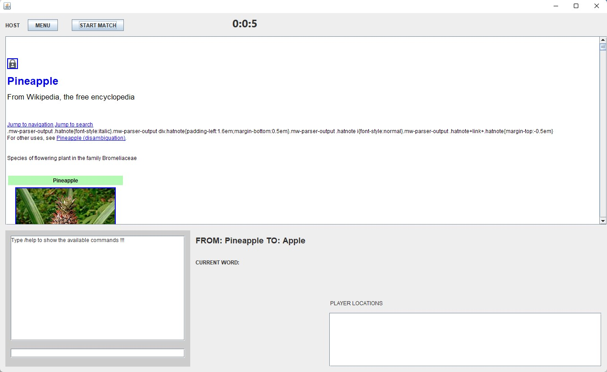

# WIKIPLAY

----------------------------------------------------------------
The wikipedia game that is played by surfing from a ARTICLE A to an ARTICLE B using the hyperlinks of a wikipedia page. This game can only be played in LAN.

## How it works:

There are two types of players . Hosts host the game (RoomServer) and the chat server while normal players start the game(room) and client clients. 

## How to run the game:

1.  Run the ServerList.java file.
2.  Run the App.java file as many times as player you want to have.

## Considerations:

1.  Sometimes the gui does not work properly and frezzes. This can be solved by resizing the window.
2.  Sometimes if the wikipedia page is heavy the app frezzes for seconds.
3.  The chronometer should be threaded but I had no time to do that.

---
Made by Endika Aguirre Eguizabal
Have fun !!!
